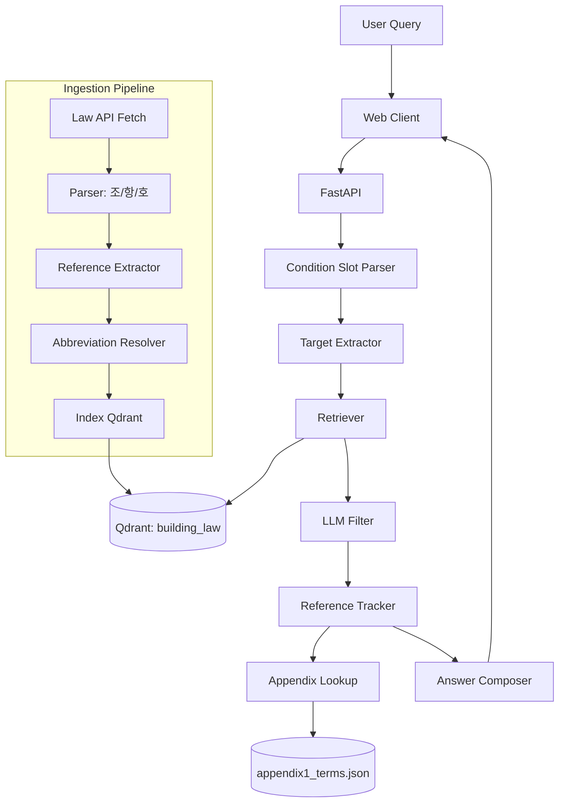

# Grounded: 건축 법령 AI 에이전트 (포트폴리오용)

> 법령 검색을 넘어, **조건 기반 판단 + 조문 근거 + 계산 과정**까지 제공하는 AI 에이전트 서비스

## Live Demo

- Live Demo: `https://grounded.wavetox.com/`


## Overview

Grounded는 건축 인허가 질의를 자연어로 입력하면 관련 조문을 검색하고, 조건을 구조화한 뒤, 계산 가능한 질문은 근거와 함께 결과까지 제시하는 법령 특화 AI 서비스입니다.

핵심 문제는 법령 데이터의 복잡성이었습니다. 실제 문서는 조/항/호 구조, 별표, 약어, 상호참조가 얽혀 있어 단순 벡터 검색만으로는 실무 품질을 만들기 어렵습니다. 이 문제를 해결하기 위해 검색, 근거 확장, 답변 생성 단계를 분리하고 상태 그래프로 제어하는 구조를 설계했습니다.


## Key Features

1. 조건 슬롯 추출 기반 질의 정규화
- 주소/용도/대지면적/연면적/층수/도로너비 등 조건 구조화
- 누락 슬롯 자동 탐지

2. 타겟 중심 법령 검색 + LLM 필터
- `건축선`, `용적률`, `건폐율`, `주차` 타겟 추출
- 타겟별 검색 결과 관련도 재판정

3. 0-hop 고속 응답 경로
- 프론트 연동에서 지연을 줄이는 빠른 경로
- `references` 기반 근거 표시

4. 참조 추적 기반 근거 확장
- 내부 참조/모법 참조 추적
- 유사도 검색 단독 사용 시의 근거 누락 보완

5. 별표(appendix) 전용 룩업
- 별표 1 용도 분류 별도 인덱스
- 정확 매칭 -> 별칭 매칭 -> 키워드 유사도

## Architecture



## Challenges & Solutions

1. 법령 상호참조로 인한 근거 누락
- 문제: 단순 검색으로는 판단에 필요한 참조 조문 누락
- 해결: `internal_refs`, `parent_law_refs` 추적 단계 분리
- 결과: 근거 연관성/답변 신뢰도 개선

2. 복합 질의에서 검색 잡음 증가
- 문제: 복수 타겟 질의에서 무관 조문 유입
- 해결: 타겟별 검색 후 LLM 필터
- 결과: 후보 조문 precision 향상

3. 응답 속도와 근거 설명의 트레이드오프
- 문제: 참조 확장 경로의 지연
- 해결: 0-hop 경로 분리 + 필요 시 확장 경로
- 결과: 체감 속도/근거 품질 균형 확보

## Prompts 

실제 서비스에 반영된 프롬프트와 일부 상이할 수 있습니다.

### 1) Target Extraction

```text
너는 건축 인허가 질의에서 '무엇을 구해야 하는지' 타겟을 추출한다.
출력은 JSON만 반환:
{"targets":["...","..."]}
규칙:
- 질문에 명시된 타겟만 추출
- 복수 타겟이면 모두 포함
- 타겟이 없으면 빈 배열

query: {query}
```

### 2) Target Result Filter

```text
너는 법령 검색 결과 필터 심사기다.

### Rules
- target과 직접적으로 관련된 조문만 keep=true로 판정한다.
- 특정 지역이나 조건에 해당하는 조문일 경우, target이 특정 지역에 해당된다면 keep=true로 판정한다.
- target과 무관한 조문은 keep=false로 판정한다.
- 오직 JSON 형식으로만 출력한다. 다른 텍스트는 무시한다.

### Output Format:
"judgments":["idx":0,"keep":true,"reason":"..."]

### Context
target: {target}
Chunks: {items}
)
```

### 3) Ref Expansion Need Check

```text
너는 법률 QA의 ref 필요성 판단기다.
중요: ref 내용을 미리 보지 말고, 현재 컨텍스트만으로 답변 가능한지 판단한다.
기준:
- 현재 컨텍스트만으로 질문의 판단/계산이 가능하면 answerable=true
- 조문 이해를 위해 참조 법령/조항 해석이 필수면 answerable=false
출력은 JSON만:
{"answerable": true/false, "reason": "..."}

query: {query}
targets: {targets}
current_contexts: {evidence}
```

### 4) Ref Follow Decision

```text
너는 법률 참조 추적 판단기다.
중요: ref 조문 본문은 아직 읽지 않는다. 현재 chunk 맥락만으로 판단한다.
출력은 JSON만:
{"follow": true/false, "priority": 0|1|2, "reason": "..."}

query: {query}
targets: {targets}
current_chunk_preview: {source}
raw_ref: {raw_ref}
ref_key: {ref_key}
```

### 5) Final Answer Generation

```text
당신은 20년 경력의 건축사입니다.
당신의 전문성을 발휘하고, 관련 문서를 기반으로 사용자 질문에 대해 답변하세요.
주의: 제공된 문서 내용을 기반으로 정확하게 답변하세요.
근거에 없는 수치/조건은 추정하지 말고 '근거 불충분'이라고 작성하세요.
출력 형식:
1) 질문 요약
2) 적용 근거
3) 판단
4) 추가 필요조건

사용자 질문: {query}
관련 문서: {evidence}
(조건부) 참조 문서: {ref_evidence}
```

### 6) Condition Slot Extraction

```text
너는 건축 인허가 질의에서 조건 슬롯을 추출한다.
출력은 JSON만: {"conditions": {...}}
가능 슬롯: usage, road_width_m, lot_area_m2, floors, height_m, address, district
값이 없으면 키를 만들지 말고 추측하지 마라.

input: {text}
```

### 7) Clarification Decision

```text
너는 건축법률 협업 에이전트의 추가질문 판단기다.
출력 JSON: {"need_clarification": true/false, "question":"...", "reason":"..."}
현재 query/targets/user_facts와 contexts(본문)를 모두 보고 판단한다.
추측 금지.

query: {query}
targets: {targets}
user_facts: {user_facts}
dialogue_history: {dialogue_history}
context_memory: {context_memory}
contexts: {contexts}
```

### 8) Post-Answer Consistency Check

```text
너는 법률 답변 일관성 검사기다.
현재 answer가 사용자 추가입력 없이 완결적인지 판단한다.
출력 JSON: {"need_clarification": true/false, "question":"...", "reason":"..."}
- answer가 추가 정보가 필요하다고 말하면 need_clarification=true
- true이면 사용자에게 바로 답할 수 있는 질문 1개를 만든다.
- false이면 question은 빈 문자열.

query: {query}
targets: {targets}
user_facts: {user_facts}
answer: {answer}
```

### 9) Clarification Reply Interpretation 

```text
사용자 명확화 응답을 해석해라. JSON만 반환.
{"utterance_type":"answer|requestion|decline|other","extracted_facts":{},"refined_question":"..."}
clarification_question: {clarification_question}
user_reply_text: {user_reply_text}
dialogue_history: {dialogue_history}
context_memory: {context_memory}
```

### 10) Calculator Prompt

```text
너는 건축법률 계산 엔진이다. 근거 조항, 계산식, 중간값, 최종값을 모두 명시하라.
조건: {conditions}
질문: {user_query}
컨텍스트 조항: {article_nums}
```

### 11) Simple LLM Chat Prompt

```text
You are an architect with 20 years’ experience.
Your name is 아키.

### Rules
- Respond based on your architectural expertise.
- Explain in a way that is easy to understand.
- Respond concisely in Korean.

### 대화 이력:
{hist_text}

### 질문:
{query}
```

### 12) Abbreviation Extraction by Law 

```text
다음 법령 텍스트에서 축약어 정의만 추출하라.
규칙:
1) 축약어가 아닌 일반 단어는 제외
2) 값은 가능한 한 조항 정보를 포함해 완전한 명칭으로 작성
3) JSON 객체만 출력
출력 형식 예시: {"법": "건축법", "위원회": "건축법 제4조에 따른 건축위원회"}

법령명: {law_name}
텍스트:
{context}
```

### 13) Abbreviation Extraction by Chunk

```text
다음 단일 조문에서 정의된 축약어만 JSON으로 추출하라.
반드시 축약어 키와 확장명 값만 포함하고, 모르면 빈 JSON을 반환하라.
규칙:
1) 축약어 패턴은 보통 '(이하 "X"이라 한다)'
2) 값은 가능한 완전한 명칭으로 작성
3) 출력은 JSON 객체만
예시: {"위원회": "건축법 제4조에 따른 건축위원회"}

법령명: {chunk.law_name}
조문: 제{chunk.article_num}조
제목: {chunk.article_title}
본문:
{text}
```

## Screenshots

- 홈/채팅 화면: `assets/screenshots/home.png`
- 법령 근거 패널: `assets/screenshots/references.png`
- 타겟 검색 결과: `assets/screenshots/target-search.png`

## Tech Stack

### AI / LLM
- LangChain
- LangGraph
- CLOVA X (Chat + Embeddings)

### Retrieval / Data
- Qdrant (Vector DB)
- 법령 API 데이터 파싱 파이프라인 (Python)
- JSON 기반 별표 인덱스

### Backend
- FastAPI
- Pydantic

### Infra / Ops
- Docker
- Railway / Vercel

## Public Code Snippets

비공개 저장소 전체를 공개하지 않고도 설계 역량을 보여주기 위해, 핵심 AI 로직 일부를 스니펫으로 분리했습니다.

- [Slot Parser](./snippets/01_condition_slot_parser.py)
- [Target Retrieval + Filter](./snippets/02_target_retrieval.py)
- [Reference Tracking](./snippets/03_reference_tracker.py)
- [Appendix Lookup](./snippets/04_appendix_lookup.py)

## Repository Policy (Public)

이 저장소는 포트폴리오 목적의 공개 버전입니다.

- 포함: 아키텍처/핵심 로직 스니펫/실제 프롬프트/문제 해결 사례
- 제외: 운영 전체 코드, 민감 설정, 내부 배포 구성, 비공개 비즈니스 로직
