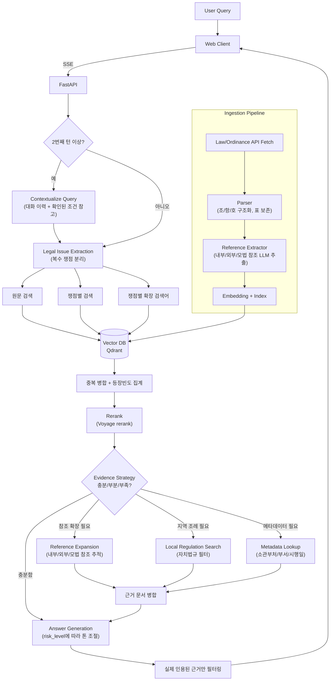
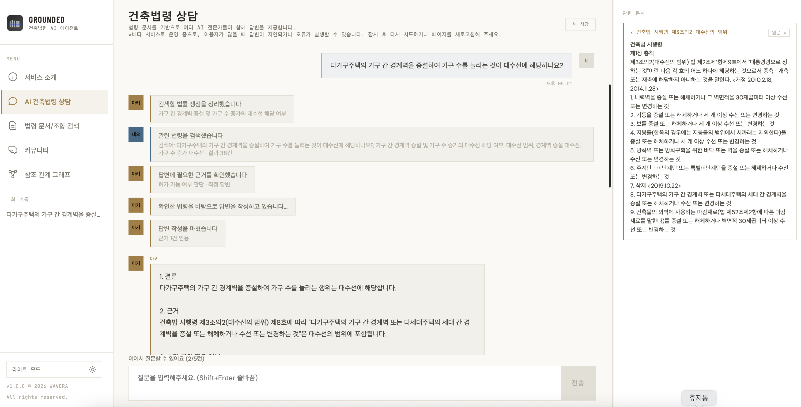
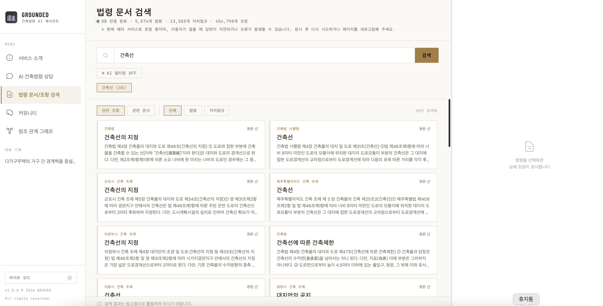
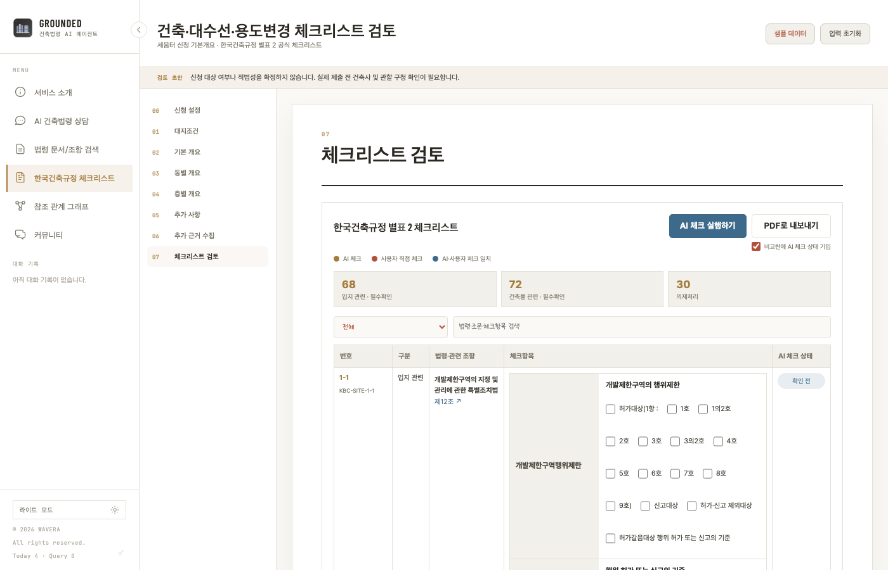
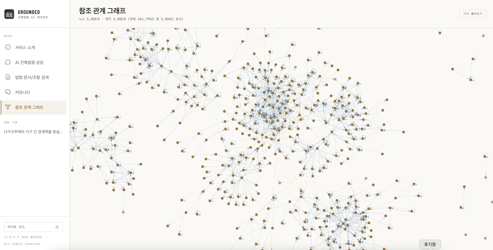

# GROUNDED (그라운디드): 건축 법령 AI 에이전트 (포트폴리오용)

> 법령 검색을 넘어, **대화형 상담 + 조문 근거 + 참조 관계 추적**까지 제공하는 AI 에이전트 서비스

## 베타서비스 사이트

- `https://grounded.thewavera.com/`

## Overview

GROUNDED는 건축 인허가 관련 질의를 자연어로 입력하면, 관련 법령/자치법규 조문을 검색하고 근거를 확장한 뒤 실제 조문을 인용해 답변하는 법령 특화 AI 상담 서비스입니다. 1인 개발로 시작해 실사용 서비스로 배포·운영 중이며, 법령(5,000여 건)과 지자체 자치법규를 함께 다룹니다.

핵심 문제는 법령 데이터의 복잡성이었습니다. 실제 조문은 조/항/호 구조, 다른 조문·다른 법령에 대한 상호참조, 지자체별로 달라지는 조례가 얽혀 있어 단순 벡터 검색만으로는 실무 품질의 답변을 만들기 어렵습니다. 이 문제를 해결하기 위해 (1) 질의에서 법률 쟁점을 뽑아 여러 방식으로 검색하고, (2) 근거가 충분한지 판단해 필요한 것만 추가로 모으고, (3) 여러 턴에 걸친 대화에서는 이전 문맥으로 다음 질문을 재작성하는 파이프라인을 설계했습니다.

## Key Features

1. 법률 쟁점 기반 검색
- 질문에서 검색해야 할 법률 쟁점을 추출(예: "건폐율, 건축선"처럼 복수 쟁점을 각각 분리)
- 원문 검색 + 쟁점별 검색 + 쟁점별 확장 검색어를 함께 사용, 중복 등장 빈도로 후보를 재정렬

2. 근거 수집 전략 판단
- 1차 검색 결과만으로 답변이 충분한지, 참조 조문 확장이 필요한지, 지역 조례를 더 찾아야 하는지, 담당부서 정보가 필요한지를 답변 생성 전에 먼저 판단
- 질문의 위험도(단정하면 안 되는 허가/위반 판단 등)에 따라 답변 톤을 다르게 유도

3. 참조 조문 추적 + 관계 시각화
- 조문 안의 내부/외부 참조를 추적해 검색에 안 잡힌 근거 조문을 추가로 확보
- 법령 간 참조 관계를 그래프로 시각화하는 별도 페이지 제공

4. 대화형 멀티턴 상담
- 첫 질문 이후 이어지는 질문("그럼 주차장은?")을 이전 대화 맥락으로 독립적인 질문으로 재작성해서 검색
- 대화 중 확인된 조건(지역/용도/공사유형 등)을 다음 턴에도 유지하고, 정정되면 갱신

5. 자치법규 통합 검색
- 국가 법령뿐 아니라 지자체 조례/규칙까지 같은 파이프라인으로 검색
- 법령 표(table)를 원문 구조를 살려 화면에 표시

6. 한국건축규정 체크리스트 (국토교통부 공식 서식 기반)
- 대지조건/기본개요/동별·층별 개요를 입력하면 국토교통부 한국건축규정 별표 2 체크리스트(170개 항목)를 자동으로 채울 범위를 판정
- 입력된 정보를 근거로 각 항목을 AI가 검토해 확인/직접 판단/추가 확인 필요로 분류, 근거 조문을 함께 제시
- 원본 공식 서식 그대로 PDF로 내보내기 지원(AI 검토 상태를 비고란에 함께 기입할지 선택 가능)

## Architecture



**흐름 요약**
1. 두 번째 턴부터는 이전 대화·이미 확인된 조건을 반영해 질문을 독립적인 형태로 재작성한 뒤 검색을 시작합니다.
2. 질문에서 법률 쟁점을 분리하고, 원문/쟁점/확장 검색어 세 갈래로 검색한 뒤 등장 빈도와 재정렬 점수로 후보를 추립니다.
3. 근거가 충분한지 먼저 판단하고, 부족한 부분만 선택적으로(참조 조문/지역 조례/메타데이터) 추가로 모읍니다.
4. 답변은 질문의 위험도(단정 가능 여부)에 따라 톤을 조절하고, 실제로 인용한 근거만 화면에 노출합니다.

**오케스트레이션 — LangGraph 마이그레이션**

위 흐름은 처음엔 하나의 함수 안에서 `if`로 분기하는 절차적 코드로 구현했습니다. 대화 재개 시 이전 턴의 상태 중 일부만 이어받는 버그가 반복되자(어떤 필드를 이어받을지가 여러 곳에 흩어져 있어 하나씩 빠뜨리기 쉬움), 검색·근거수집 로직은 그대로 두고 **제어 흐름만 LangGraph의 `StateGraph`로 옮겼습니다** — 위 다이어그램의 각 단계가 노드로, `PLAN`/`C0` 같은 분기점이 조건부 엣지로 대응됩니다. 기존 로직은 한 줄도 재작성하지 않고 그대로 노드에서 호출만 하도록 감싸서, 프롬프트나 답변 품질에는 영향 없이 오케스트레이션 레이어만 교체했습니다. SSE 스트리밍도 LangGraph의 커스텀 스트림(`stream_mode`)으로 그대로 유지됩니다.

## Challenges & Solutions

1. 법령 상호참조로 인한 근거 누락
- 문제: 조문에 적힌 참조 표현(`"제19조의15"` 같은 본조+가지번호 결합 형태)이 실제 검색 인덱스의 필드 구조(본조/가지번호 분리 저장)와 형태가 달라서, 참조가 실제로 존재하는 조문을 가리켜도 매칭에 계속 실패
- 해결: 참조 표현을 인덱스 필드 형태로 분리하는 정규화 단계 추가, 참조 매칭 전용 조회 경로 별도 구성
- 결과: 검색 결과에 없던 근거 조문(결격사유 등)이 실제로 답변에 반영됨을 확인

2. 후속 질문이 이전 문맥 없이 검색되는 문제
- 문제: "그럼 주차장은?" 같은 후속 질문을 그대로 검색하면 이전 대화("다가구주택 증축")의 맥락이 사라져 무관한 결과가 섞임
- 해결: 이전 대화 이력 + 이미 확인된 사용자 조건을 참고해 현재 질문을 독립적인 질문으로 재작성하는 단계를 검색 전에 추가
- 결과: 재작성된 질문으로 검색하니 실제로 관련 조례(부설주차장 설치기준)가 근거로 잡히는 것을 확인

3. 외부 LLM API의 일시적 무응답 대응
- 문제: 참조 추출용 LLM 호출이 timeout 없이 대기하도록 구성돼 있어, 외부 API가 응답 없이 연결만 유지하면 작업 전체가 무기한 정지
- 해결: 명시적 timeout + 지수 백오프 재시도(rate limit뿐 아니라 일반 네트워크 오류도 포함)로 교체
- 결과: 일시적 장애 시에도 자동 복구되어 대량 배치 작업이 계속 진행

4. 오케스트레이션 프레임워크 마이그레이션 중 프레임워크 자체의 숨겨진 동작 발견
- 문제: 절차적 분기 코드를 LangGraph `StateGraph`로 옮긴 뒤, 범위 외 질문이 정상 검색 경로로 새는 라우팅 버그 발생 — 조건부 엣지 함수의 파라미터에 상태 타입힌트를 붙이면 LangGraph가 "이 분기는 타입에 선언된 필드만 필요하다"고 자동 추론해서, 동적으로 추가한 상태 키를 라우팅 시점에 조용히 누락시키는 게 원인이었음(공식 문서에 명시되지 않은 동작)
- 해결: 소스 레벨에서 원인을 직접 추적(내부 스코프 추론 로직 확인) 후, 조건부 엣지가 참조하는 모든 상태 키를 타입 스키마에 명시적으로 선언
- 결과: 신구 오케스트레이션을 동일 입력으로 나란히 실행해 라우팅·응답·실시간 스트리밍이 모두 동등함을 확인 후 프로덕션에 적용

5. 스캔본이 아닌 원본 PDF 서식에 실제로 체크 표시를 찍는 문제
- 문제: 국토교통부 공식 체크리스트 PDF(170개 항목·1,188개 체크박스)는 AcroForm 필드가 없는 텍스트 기반 문서라, 값만 채우는 방식은 불가능 — 좌표를 찾아 직접 그려 넣어야 함. 항목 번호 라벨의 y좌표를 앵커로 삼는 1차 방식은 라벨이 셀 안에서 세로 중앙 정렬돼 있어 127개(75%) 항목에서 체크박스 개수가 실제와 불일치
- 해결: 텍스트 위치 대신 PDF에 벡터로 그려진 표 경계선(가로선) 좌표를 기준으로 각 항목의 행 범위를 재구성하는 방식으로 전환 — 번호가 다음 행 경계까지 걸치는 경우(하위 그룹 병합)도 처리
- 결과: 170개 항목 전체 좌표 매핑 검증 100% 달성, 매핑이 검증 안 된 항목은 추정으로 잘못된 칸에 체크하는 대신 표시를 생략하도록 설계

## Prompts

실제 서비스에 반영된 프롬프트를 단순화한 예시입니다 — 정확한 문구/제약조건은 프로덕션 프롬프트와 다를 수 있습니다.

### 1) Legal Issue Extraction

```text
너는 건축법령 검색 쿼리 생성기다.
사용자 질문에서 검색해야 할 독립적인 법률 쟁점을 모두 추출하고, 각 쟁점의 추가 검색어를 생성한다.

출력 형식:
{"legal_issues": [{"issue": "...", "search_queries": ["...", "..."]}]}

규칙:
- 질문에 포함된 서로 다른 법률 쟁점을 각각 별도 issue로 추출한다.
- 지역명, 주소, 숫자, 건물명은 독립적인 issue로 만들지 않는다.
- 질문에 없는 법령명, 조문 번호 또는 사실관계를 추측하지 않는다.

query: {query}
```

### 2) Evidence Collection Strategy

```text
당신은 건축법률 상담의 근거 수집 및 답변 전략을 결정한다.
사용자 질문과 1차 검색 결과를 분석하여 최종 답변 전에 추가로 조회해야 할 정보를 판단하라.
실제 답변이나 추가질문은 생성하지 않는다.

출력 형식:
{"primary_intent": "...", "risk_level": "low|medium|high",
 "evidence_status": "sufficient|partial|none",
 "answer_mode": "direct|conditional|insufficient",
 "needs_reference_expansion": false, "needs_local_regulation": false,
 "additional_search_queries": [], "missing_facts": []}

query: {query}
user_facts: {user_facts}
initial_contexts: {contexts}
```

### 3) Contextualize Follow-up Query

```text
너는 건축법령 상담 대화의 문맥을 정리하는 역할이다.
현재 사용자 질문이 이전 대화를 참조하는지 판단하고,
법령 검색에 사용할 수 있는 독립적인 질문으로 다시 작성하라.

규칙:
- 지시어("그거", "그럼" 등)는 이전 대화에서 확인되는 대상으로 치환한다.
- 기존에 확인된 사용자 조건(지역/용도/공사유형 등)은 유지하되, 사용자가 새 조건을 말하면 갱신한다.
- 이전 대화에서 확인되지 않은 조건은 추측하지 않는다.

출력 형식:
{"standalone_query": "...", "is_follow_up": true, "user_facts": {...}}

이전 대화 요약: {conversation_summary}
현재 질문: {query}
```

### 4) Final Answer Generation

```text
당신은 30년 경력의 건축사입니다.
사용자 질문, 근거 수집 전략, 법령 근거를 바탕으로 답변하세요.

작성 규칙:
- 제공된 근거 문서에 있는 내용만 법적 근거로 사용한다.
- 근거에 없는 수치/조건/법령명은 추정하지 않는다.
- risk_level이 high이면 허가 가능 여부, 위반 여부를 단정하지 않는다.
- 실제 답변에 사용한 문서만 인용 목록에 포함한다.

답변 구조: 1) 결론 2) 근거 3) 추가 확인 필요 여부

query: {query}
evidence: {evidence}
```

## Tech Stack

### AI / LLM
- Google Gemini / Ollama Cloud (provider 교체 가능한 구조)
- Voyage AI (임베딩 + 재정렬)

### Retrieval / Data
- Qdrant Cloud (Vector DB)
- 법령/자치법규 API 데이터 파싱 파이프라인 (Python)
- SQLite (법령 메타데이터), Supabase (대화 기록/피드백 로깅)

### Backend
- FastAPI, Pydantic
- LangGraph (`StateGraph`) 기반 오케스트레이션 — 검색/근거수집 로직은 그대로 두고 제어 흐름만 그래프로 구성
- SSE(Server-Sent Events) 기반 진행상황 스트리밍
- PyMuPDF — 벡터 표 경계선 좌표 추출 + 원본 PDF 서식에 체크 표시 렌더링

### Frontend
- React + Vite
- 그래프 시각화(vis-network)

### Infra / Ops
- Docker
- Railway (백엔드) / Vercel (프론트엔드)

## Screenshots
- AI 건축법령 상담


- 법령 문서/조항 검색


- 한국건축규정 체크리스트


- 참조 관계 그래프



## Public Code Snippets

비공개 저장소 전체를 공개하지 않고도 설계 역량을 보여주기 위해, 핵심 로직을 단순화한 스니펫으로 분리했습니다(실제 프로덕션 코드 그대로가 아닌 개념 설명용 재구현입니다).

- [Slot Parser](./snippets/01_condition_slot_parser.py)
- [Target Retrieval + Filter](./snippets/02_target_retrieval.py)
- [Reference Tracking](./snippets/03_reference_tracker.py)
- [Appendix Lookup](./snippets/04_appendix_lookup.py)

## Repository Policy (Public)

이 저장소는 포트폴리오 목적의 공개 버전입니다.

- 포함: 아키텍처/핵심 로직 스니펫/단순화된 프롬프트 예시/문제 해결 사례
- 제외: 운영 전체 코드, 민감 설정, 내부 배포 구성, 비공개 비즈니스 로직
